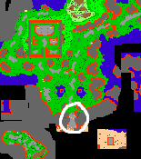

# Retro Quest 2

**Level Required:** ?

**Rewards:** ?

**Location:** Narnia, Fibula

**Monsters:** ?

First head to the South-Western part of Narnia and speak to the Sentinel Guard blocking the gate.

<figure><figcaption></figcaption></figure>

The keywords are "Hi - Chalice - Chalice"

<figure><figcaption></figcaption></figure>

Then head to the Bartender Bartholomew in Fibula

<figure><figcaption></figcaption></figure>

The keywords are "Hi - Chalice"

<figure><figcaption></figcaption></figure>

After fighting some monsters you well be sent into a puzzle.

<figure><figcaption></figcaption></figure>

<figure><figcaption></figcaption></figure>

Walk to the West and click the South West Door.

<figure><figcaption></figcaption></figure>

After appearing in the ring, head east.

<figure><figcaption></figcaption></figure>

You should arrive in Retro Fibula, unlocking the shortcut at the Ring of Stones north of the bar.

It allows you to enter and leave Retro Fibula.

<figure><figcaption></figcaption></figure>

.png>).png>)

Head down the Well in the center of town.

<figure><figcaption></figcaption></figure>

Find Xander and ask him for a Mission.

Clicking the trees opens the passage up.

<figure><figcaption></figcaption></figure>

After slaying 400 Rotworms you'll receive a Yellow Spellwand.

<figure><figcaption></figcaption></figure>

Head back west into the Rotworm spawn, find the Rotworm King and slay him before activating the lever and the teleport.

<figure><figcaption></figcaption></figure>

<figure><figcaption></figcaption></figure>

<figure><figcaption></figcaption></figure>

This opens the Bridge to the South of the central castle.

<figure><figcaption></figcaption></figure>

Levitate on the South East side and follow the hidden path.

<figure><figcaption></figcaption></figure>

Open the chest to receive a Pink Spellwand.

<figure><figcaption></figcaption></figure>

Use the nearby lever, summoning Galadriel inside the Central Castle.

<figure><figcaption></figcaption></figure>

Have a conversation with him to enter the door.

"Hi - Pay - Open - How Long - Level 100"

<figure><figcaption></figcaption></figure>

Use the book found downstairs, this allows you to enter into the northern Castle Door containing Archaic Monks.

<figure><figcaption></figcaption></figure>

<figure><figcaption></figcaption></figure>

Find the Lever, opening further passages.

<figure><figcaption></figcaption></figure>

<figure><figcaption></figcaption></figure>

A chest containing 1 Upgrade Crystal is located nearby as well.

<figure><figcaption></figcaption></figure>

Speak with Lawrence, asking for a mission.

<figure><figcaption></figcaption></figure>

<figure><figcaption></figcaption></figure>

To find his knife head back up to the surface to the South-West

<figure><figcaption></figcaption></figure>

<figure><figcaption></figcaption></figure>

Enter into the doors, activate the lever and head to the Central Castle, East side.

<figure><figcaption></figcaption></figure>

Beyond the Archaic Dragons and Dragon Lords, you will find a teleport leading to a chest.

<figure><figcaption></figcaption></figure>

Open the chest to find a Red Spellwand.

<figure><figcaption></figcaption></figure>

Head back to the West, find the Minotaur spawn with a hole, nearby on a mountain there is a chest with a golden key.

<figure><figcaption></figcaption></figure>

This allows you into the Hero Tower to the East, with the knife at the top.

<figure><figcaption></figcaption></figure>

Report back to Lawrence.

<figure><figcaption></figcaption></figure>

You will receive the last Spellwand needed.

Find Cinder to the West, south of where you appear after entering the well.

Ask him for a mission when holding all 4 spellwands.

<figure><figcaption></figcaption></figure>

Continue on, beware of the dangerous monsters.

<figure><figcaption></figcaption></figure>

<figure><figcaption></figcaption></figure>

That's all for now!
